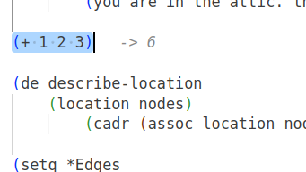
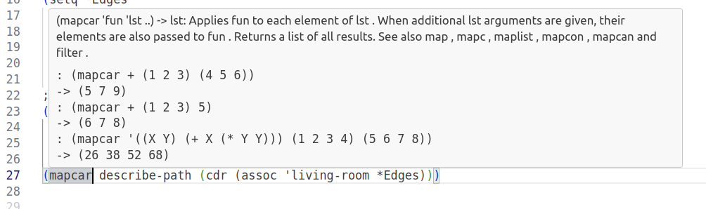

# picolode

PicoLode is a VS Code extension for evaluating PicoLisp code inline. It allows you to run selected code or the current line using the `pil` command-line interpreter and shows results directly in the editor.

## Features

- Evaluate PicoLisp selection using `Ctrl+Enter` or `Ctrl+Shift+Enter`.
- Display results inline as a decoration. 




- Provides functionality for displaying documentation on hover. This feature allows users to view relevant documentation when hovering over code elements, enhancing code readability and developer productivity.



## Requirements

- `pil` PicoLisp interpreter must be installed and available in your PATH.
- Node.js (>= 16) and npm to build the extension.

## Usage

1. Select PicoLisp code or place the cursor on a line.
2. Press the configured hotkey (default: `Ctrl+Enter` for evaluation, `Ctrl+Shift+Enter` for inline) or run `Evaluate PicoLisp Selection` / `Evaluate PicoLisp Inline` from the command palette.
3. Optionally configure (in Settings → Extensions → PicoLisp):
   - `picolode.pilPath` — path to the `pil` executable (default: `pil`)
   - `picolode.timeout` — evaluation timeout in milliseconds (default: 5000)

### File Associations

If `.l` files aren't recognized as PicoLisp, add to your settings:

```json
{
  "files.associations": { "*.l": "picolisp" }
}
```

## Development — build, run and package

These steps help you build the extension locally, run it in the Extension Development Host and produce a `.vsix` for installation.

Prerequisites
- Node.js and npm
- VS Code (for debugging and running the Extension Development Host)
- `pil` PicoLisp interpreter available on PATH

Install dependencies

```bash
npm install
```

Build the extension (single build)

```bash
npm run compile
```

Build in watch mode (rebuilds on file change)

```bash
npm run watch
```

Run tests

```bash
npm test
```

Run in VS Code debug host

1. Open this repository in VS Code.
2. Press F5 to launch the Extension Development Host. This opens a new VS Code window with the extension loaded for testing.

Package and install the extension (.vsix)

Webpack is used to produce the compiled extension files. To create a distributable VSIX you can use the `vsce` tool (not included in devDependencies by default):

```bash
# build production bundle
npm run package

# install vsce (if you don't have it)
npm install -g vsce

# create .vsix in the current folder
vsce package

# install the produced .vsix locally
code --install-extension picolode-0.0.1.vsix
```

Notes
- `npm run package` runs webpack in production mode and prepares the compiled files. `vsce package` creates the final .vsix that can be installed or published to the Marketplace.

## Mini roadmap

Short list of near-term ideas and improvements (prioritized):

1. Better inline formatting — make long outputs collapsible / multi-line and add copy buttons.
2. Background REPL panel — persistent REPL output window to run snippets and keep session state.
3. Async execution & long-running tasks — show progress and cancel support for slow evaluations.
4. Improved error handling — surface PicoLisp stack traces and map them to source lines when possible.
5. CI and unit/integration tests — run tests on push and add basic integration tests for evaluation behavior.

If you'd like to contribute, pick a roadmap item, create an issue and open a PR.

## Contributing

Contributions are welcome. Typical workflow:

1. Fork the repo, create a feature branch.
2. Install deps and run the test suite locally: `npm install && npm test`.
3. Build and verify in the Extension Development Host (F5).
4. Open a PR describing the change.

---

If you need help building or debugging the extension locally, open an issue or ping in the PR and include your OS, Node.js version and `pil` path.
